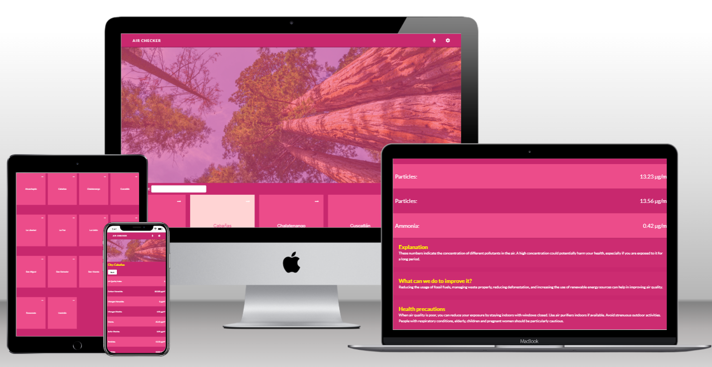

# Air Checker

<a name="readme-top"></a>

<div align="center">
    
  <br/>
  <h3><b>Air Checker</b></h3>
</div>

<!-- TABLE OF CONTENTS -->

# 📗 Table of Contents

- [Air Checker](#air-checker)
- [📗 Table of Contents](#-table-of-contents)
- [📖Air Checker ](#air-checker-)
  - [🛠 Built With ](#-built-with-)
    - [Tech Stack ](#tech-stack-)
    - [Key Features ](#key-features-)
  - [🚀 Live Demo ](#-live-demo-)
  - [😎 Loom walkthrough ](#-loom-walkthrough-)
  - [💻 Getting Started ](#-getting-started-)
    - [Prerequisites](#prerequisites)
    - [Setup](#setup)
    - [Install](#install)
    - [Usage](#usage)
    - [Run tests](#run-tests)
    - [Deployment ](#deployment-)
  - [👥 Author ](#-author-)
  - [🔭 Future Features ](#-future-features-)
  - [🤝 Contributing ](#-contributing-)
  - [⭐️ Show your support ](#️-show-your-support-)
  - [🙏 Acknowledgments ](#-acknowledgments-)
  - [❓ FAQ ](#-faq-)
  - [📝 License ](#-license-)

<!-- PROJECT DESCRIPTION -->

# 📖Air Checker <a name="about-project"></a>

Air Checker is a web application designed for real-time monitoring of air quality in various locations across El Salvador. Developed using React.js, Redux, and Redux-Toolkit, the application displays air quality data that includes the Air Quality Index (AQI) and concentrations of several pollutants, such as Carbon Monoxide and Nitrogen Dioxide. State management is executed through Redux, utilizing async-thunk middleware for API calls and adopting the latest hooks-based React approach for functional components.

The application is mobile-friendly and has been tested with unit tests constructed using Jest and the React Testing Library. To ensure scalability and maintainability, modular and reusable components have been integrated throughout the application. Styling with CSS has been employed to provide a modern, responsive design, enhancing user interaction.

## 🛠 Built With <a name="built-with"></a>
HTML,
CSS,
JavaScript,
React.js,
Redux Toolkit,
Axios,
Jest.

### Tech Stack <a name="tech-stack"></a>

<details>
  <summary>Client</summary>
  <ul>
    <li><a href="https://developer.mozilla.org/en-US/docs/Web/HTML">HTML</a></li>
    <li><a href="https://developer.mozilla.org/en-US/docs/Web/CSS">CSS</a></li>
    <li><a href="https://developer.mozilla.org/en-US/docs/Web/JavaScript">JavaScript</a></li>
    <li><a href="https://react.dev/">React.js</a></li>
    <li><a href="https://redux-toolkit.js.org/">Redux Toolkit</a></li>
    <li><a href="https://axios-http.com/docs/intro">Axios</a></li>
    <li><a href="https://jestjs.io/">Jest</a></li>
  </ul>
</details>

<details>
  <summary>Package Manager</summary>
  <ul>
    <li><a href="https://www.npmjs.com/">npm</a></li>
  </ul>
</details>
<details>
  <summary>Linters</summary>
  <ul>
      <li><a href="https://eslint.org/">ESLint</a></li>
      <li><a href="https://stylelint.io/">Stylelint</a></li>
  </ul>
</details>

<!-- Features -->

### Key Features <a name="key-features"></a>

- **Mobile-friendly design: The application is designed with a responsive layout, ensuring a great user experience across all devices, including smartphones and tablets.**
- **Scalable and maintainable architecture: The use of modular and reusable components within the application ensures it can be easily scaled and maintained in the future.**
- **Comprehensive testing: The application's functionality has been rigorously tested using Jest and the React Testing Library, ensuring robust and reliable performance for users.**

<p align="right">(<a href="#readme-top">back to top</a>)</p>

<!-- LIVE DEMO -->

## 🚀 Live Demo <a name="live-demo"></a>

- [Live Demo Link](https://airchecker.onrender.com/)

<p align="right">(<a href="#readme-top">back to top</a>)</p>

<!-- LOOM WALKTHROUGH -->

## 😎 Loom walkthrough <a name="loom-walkthrough"></a>

- [Loom walkthrough Link](https://www.loom.com/share/82f1bf98f89540f39bd454b7bbf991fb)

<p align="right">(<a href="#readme-top">back to top</a>)</p>

<!-- GETTING STARTED -->

## 💻 Getting Started <a name="getting-started"></a>


To get a local copy up and running, follow these steps.

### Prerequisites

In order to run this project you need:

- A web browser to view output e.g [Google Chrome](https://www.google.com/chrome/).
- An IDE e.g [Visual studio code](https://code.visualstudio.com/).
- `node` should be installed in your local machine, [node website](https://nodejs.org/en/download/).
- Install the `npm` package manager use this [to install both node and npm](https://docs.npmjs.com/downloading-and-installing-node-js-and-npm).
- [A terminal](https://code.visualstudio.com/docs/terminal/basics).

### Setup

Clone this repository to your desired folder or download the Zip folder:

```
https://github.com/Alejandroq12/air-checker

```

- Navigate to the location of the folder in your machine:

**``you@your-Pc-name:~$ cd air-checker``**

### Install

To install all dependencies, run:

```
npm install
```

### Usage

To run the project, follow these instructions:

- After cloning this repo to your local machine.
- You must use `npm start` command in terminal to run this at the localhost.

### Run tests

To run tests, run the following command:

- Track CSS linter errors run:
```
npx stylelint "**/*.{css,scss}"
```
- Track JavaScript linter errors run:
```
npx eslint "**/*.{js,jsx}"
```
Run tests with Jest
```
npm test
```
### Deployment <a name="deployment"></a>

You can deploy this project using: Render,
- I used Render Pages to deploy my website.
- For more information about deployment on Netlify see "[Netlify](https://render.com/)".

<p align="right">(<a href="#readme-top">back to top</a>)</p>

<!-- AUTHORS -->

## 👥 Author <a name="authors"></a>

👤 **Julio Quezada**

- GitHub: [Alejandroq12](https://github.com/Alejandroq12)
- Twitter: [@JulioAle54](https://twitter.com/JulioAle54)
- LinkedIn: [Julio Quezada](https://www.linkedin.com/in/quezadajulio/)

<p align="right">(<a href="#readme-top">back to top</a>)</p>

<!-- FUTURE FEATURES -->

## 🔭 Future Features <a name="future-features"></a>

- [ ] **I will implement more pages**
- [ ] **I will create statistics according to each city**

<p align="right">(<a href="#readme-top">back to top</a>)</p>

<!-- CONTRIBUTING -->

## 🤝 Contributing <a name="contributing"></a>

Contributions, issues, and feature requests are welcome!

Feel free to check the [issues page](../../issues/).

<p align="right">(<a href="#readme-top">back to top</a>)</p>

<!-- SUPPORT -->

## ⭐️ Show your support <a name="support"></a>

If you like this project give me a star ⭐️

<p align="right">(<a href="#readme-top">back to top</a>)</p>

<!-- ACKNOWLEDGEMENTS -->

## 🙏 Acknowledgments <a name="acknowledgements"></a>

This application was inspired by the original design idea by Nelson Sakwa on Behance. The Creative Commons license of the design requires the appropriate credit to the original author.

[DESIGN LINK](https://www.behance.net/gallery/31579789/Ballhead-App-(Free-PSDs))

<p align="right">(<a href="#readme-top">back to top</a>)</p>

<!-- FAQ  -->

## ❓ FAQ <a name="faq"></a>

- **Did you created this project from zero?**

  - Of course, as if it were a real life job scenario.

<p align="right">(<a href="#readme-top">back to top</a>)</p>

<!-- LICENSE -->

## 📝 License <a name="license"></a>

This project is [LICENSE](./LICENSE) licensed.

<p align="right">(<a href="#readme-top">back to top</a>)</p>
