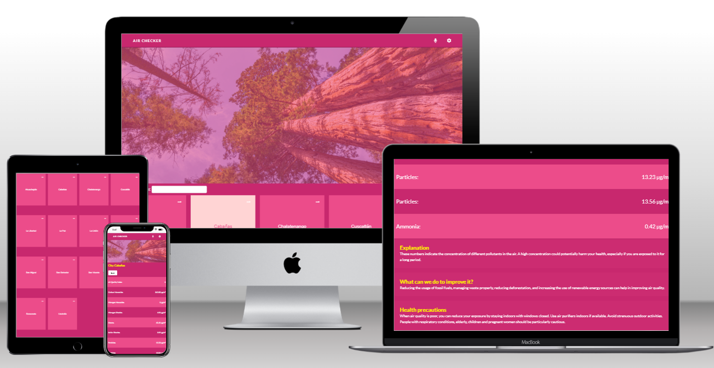

# Air Checker

> A real time air quality monitoring web app for cities across El Salvador. Built with React, Redux Toolkit, and tested with Jest. Deployed and in use at [airchecker.onrender.com](https://airchecker.onrender.com/).

<p>
  
  
  
  
  
</p>

<div align="center">
  
</div>

**Live site:** [airchecker.onrender.com](https://airchecker.onrender.com/) · **Walkthrough:** [Loom](https://www.loom.com/share/82f1bf98f89540f39bd454b7bbf991fb)

---

## The Problem

Air quality data is publicly available for most countries, but in El Salvador it is fragmented across raw API responses and not presented in a way that ordinary people can act on. Residents who want to know whether the air outside is safe for running, for their children, or for someone with asthma have to interpret Air Quality Index numbers and pollutant concentrations with no context. I wanted to build a simple web app that pulls this data for Salvadoran cities specifically and presents it in a way that makes the answer obvious in one glance.

## The Approach

A React single page application that fetches real time air quality data for multiple cities in El Salvador and displays the Air Quality Index along with concentrations of individual pollutants like Carbon Monoxide and Nitrogen Dioxide. State is managed through Redux Toolkit, with async thunk middleware handling the API calls. The app is mobile first, because most people check air quality on a phone, not a desktop. Unit tests built with Jest and React Testing Library cover the components and the Redux slices.

---

## Key Decisions

### Why Redux Toolkit over Context API

The app has multiple slices of server state that update independently: the list of cities, the currently selected city, and the pollutant data for each. Context API works for shallow state, but it re renders everything subscribed to a context when any value changes. Redux Toolkit with `createSlice` and selectors gives fine grained subscriptions and makes async flows explicit through `createAsyncThunk`. For an app that will grow more slices over time, this was the more durable choice.

### Why async thunk instead of RTK Query

RTK Query would have eliminated more boilerplate for the API layer, but it introduces its own caching model and patterns that are harder to reason about when debugging. Async thunks are closer to the underlying promise based fetch call, which made the data flow easier to trace and test. If the app grows to the point where cache invalidation and request deduplication become a real cost, migrating to RTK Query is straightforward.

### Why component level unit tests, not end to end

The app is small and the business logic lives in the Redux slices and the presentational components. Testing at that level with Jest and React Testing Library catches the meaningful regressions. Running Cypress or Playwright for end to end would have added setup complexity and slow CI runs without catching much that unit tests miss at this scale.

### Why deploy on Render

Render provides free static site hosting with automatic HTTPS and GitHub integration for continuous deployment. For a portfolio project with modest traffic, paying for Vercel or Netlify's paid tiers would be premature. The deployment is a git push with no additional configuration.

---

## Tech Stack

| Layer | Technology |
|-------|-----------|
| Framework | React |
| State management | Redux Toolkit with async thunk |
| HTTP client | Axios |
| Testing | Jest, React Testing Library |
| Linting | ESLint, Stylelint |
| Build | Babel, Webpack (via CRA) |
| CI | GitHub Actions |
| Hosting | Render |
| Data source | [public air quality API, update with specific source] |

---

## Running Locally

```bash
git clone https://github.com/Alejandroq12/air-checker.git
cd air-checker
npm install
npm start
```

The app will be available at `http://localhost:3000`.

### Environment variables

If the API requires a key, copy `.env.example` to `.env` and fill in the value before running.

### Running tests and linters

```bash
npm test
npx eslint "**/*.{js,jsx}"
npx stylelint "**/*.{css,scss}"
```

---

## Project Structure

```
public/         Static assets including logo and favicon
src/
  components/   React components (presentation and layout)
  redux/        Redux slices, async thunks, store configuration
  services/     API client and data transformation
  __tests__/    Jest unit tests
babel.config.js
```

---

## What I Learned

Working on this project clarified for me when a state management library actually earns its weight. My first draft used local component state and prop drilling, and it worked for two or three views. As soon as I added a second city with a different set of pollutants, the prop threading became unmaintainable. Moving the data layer into Redux Toolkit fixed this cleanly and taught me a simple heuristic I apply now: local state until state starts traveling through more than two components, then a store. That heuristic now informs how I think about service layers and dependency scoping in backend work.

---

## Roadmap

* Add historical air quality graphs per city
* Expand coverage to major Central American capitals
* Add browser notifications for dangerous AQI thresholds
* Migrate to Vite for faster local builds

---

## About Me

I am Julio Quezada, a backend .NET developer from El Salvador with experience building production systems at national scale. I specialize in C#, ASP.NET Core, and PostgreSQL.

**Open to remote backend roles** across US, EU, and LATAM time zones.

[Portfolio](https://www.quezadajulio.com) · [LinkedIn](https://www.linkedin.com/in/jqdeveloper) · qjuliodev@gmail.com

---

## Acknowledgments

The visual design was inspired by Nelson Sakwa's "Ballhead App" concept on Behance, used under the original Creative Commons license. [Design reference](https://www.behance.net/gallery/31579789/Ballhead-App-(Free-PSDs)).

---

## License

MIT. See [LICENSE](./LICENSE) for details.
